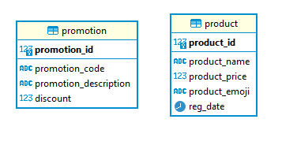
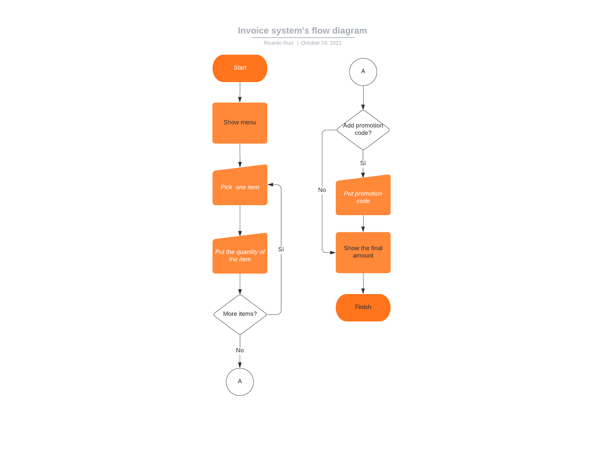

# Platzi invoice generator

Generate invoices with preloaded products.
You can check it out here: https://richend.dev/platzi_invoice/

#### Set it up in local for development.
1. Clone the project from here
2. Start your apache server and put the project there
3. run index.html

#### General Arquitecture
This product is made with MySQL, php, and vanilla Javascript

##### Structure.
- api/: where all the apirest is located.
- resources/: js,css code for the front-end
- sql/: all the sql scripts

- api/inc/config.php: conection of the database
- resources/js/global.js: url for the apiRest

#### Flowchart

## testing
save testing

